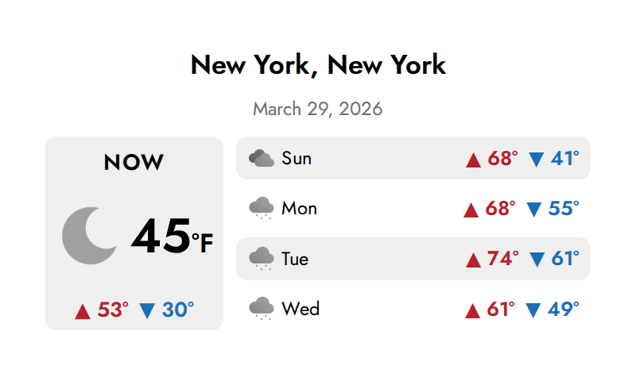
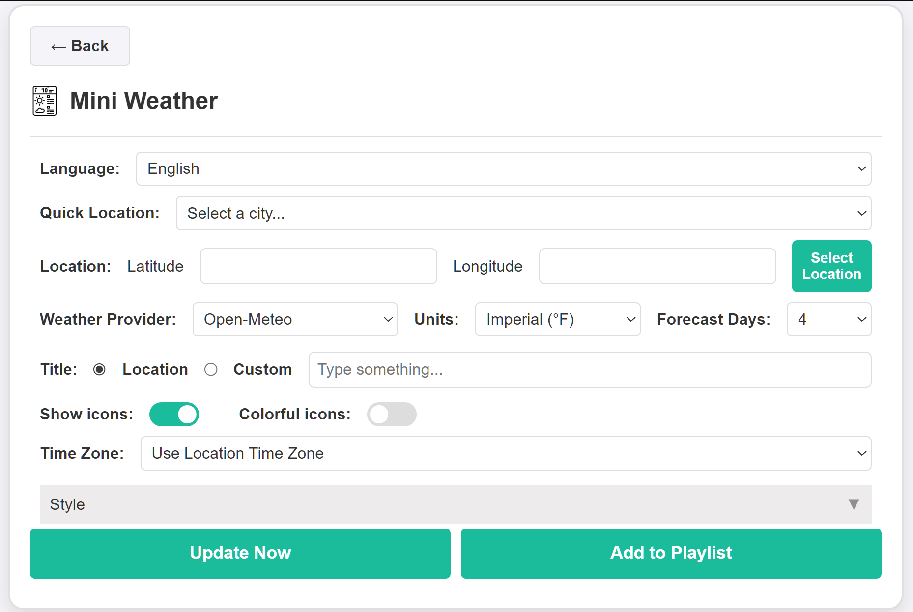

# Mini Weather Plugin for InkyPi

A lightweight Mini Weather plugin focused on clean and fast display for e-paper screens

Mini Weather **is not a replacement** for the original Weather plugin, but a simplified alternative focused on readability and ease of use. Designed for quick glance scenarios and better readability on e-paper displays.

## Install

Install the plugin using the InkyPi CLI, providing the plugin ID and GitHub repository URL:

```bash
inkypi plugin install mini_weather https://github.com/saulob/InkyPi-Mini-Weather
```

This plugin is an extension for the [InkyPi](https://github.com/fatihak/InkyPi) e-paper display frame and includes the following features:

**Features**

- Current weather with icon and temperature
- Daily forecast for upcoming days
- High and low temperatures
- Support for multiple languages
- Location selection via coordinates or quick presets
- Time zone handling based on location
- Configurable number of forecast days
- Unit selection (Celsius or Fahrenheit)
- Weather providers: Open-Meteo (no API key required) or OpenWeatherMap (API key required)

**Key differences**

Compared to the official InkyPi Weather plugin:

- Lightweight and minimal layout
- Focus on readability from a distance
- Quick location selection for faster setup and testing
- Built-in language support and localized date formatting
- Reduced configuration for a cleaner experience
- Improved readability with larger text and spacing

**Settings**

- Language selection with proper date formatting per locale
- Quick Location presets or manual latitude and longitude
- Weather provider: Open-Meteo or OpenWeatherMap (requires API key)
- Unit selection Celsius or Fahrenheit
- Forecast days selection
- Title mode: location or custom text
- Show or hide weather icons
- Optional colorful icons
- Time zone selection: location time zone or local time zone
- Style section for layout customization

**UI**

- Minimal and readable layout
- Optimized spacing for small screens
- Clear separation between current conditions and forecast
- Designed to avoid ghosting on e-paper displays

**Notes**

- Uses Open-Meteo free API (no key required) or OpenWeatherMap (API key required)
- Designed to be simple and fast, avoiding heavy rendering
- Works well with different screen sizes and orientations

**Screenshots**

- Mini Weather widget on the main dashboard
- Plugin settings screen

<p align="center">   </p>